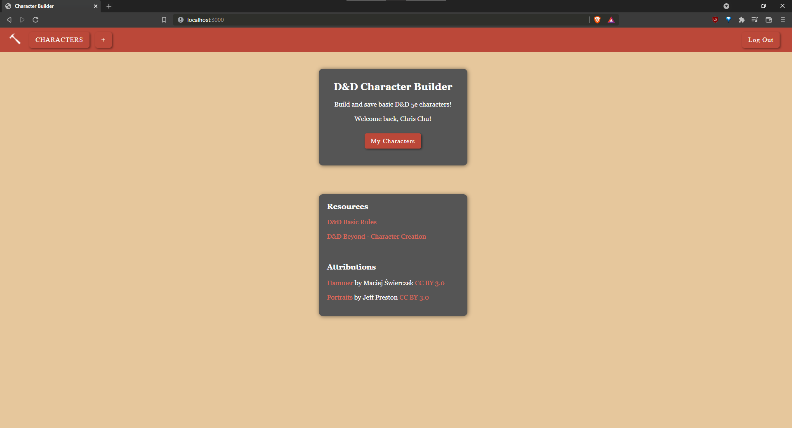
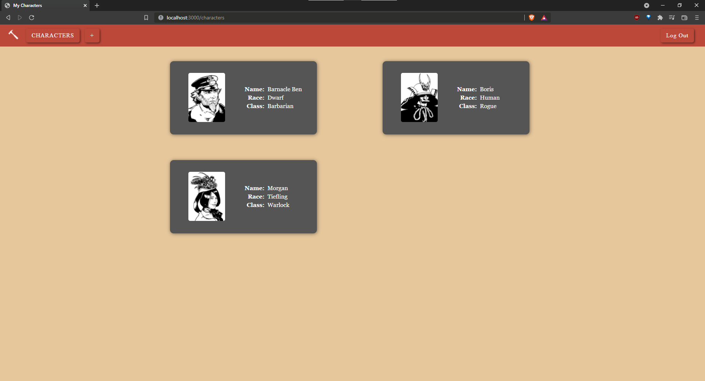
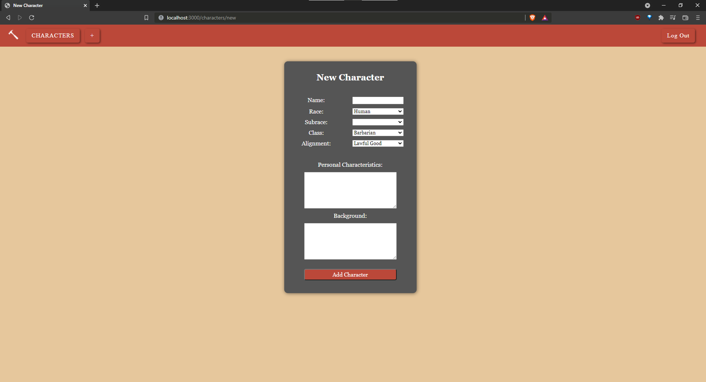
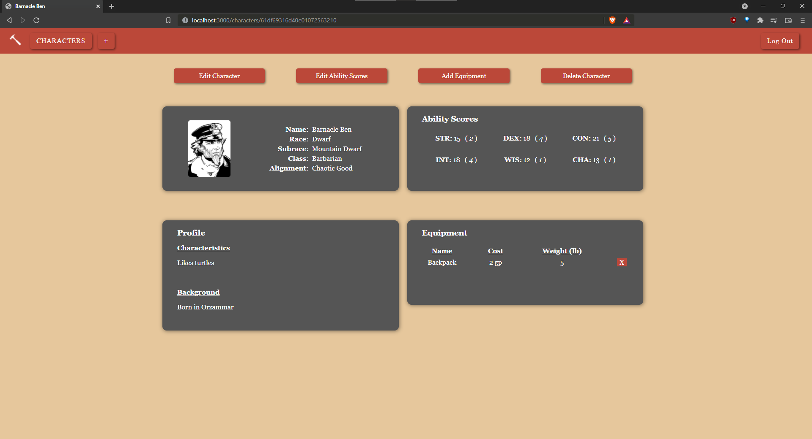

# Character Builder

A _Dungeons & Dragons_ character builder. Build and save _D&D 5e_ (PHB) characters. The app does not currently support homebrew characters or rules.

## Screenshots

    
    

    
    

## Technologies Used
Express.js, Node.js, MongoDB, HTML, CSS, and Javascript

## Getting Started

[Link to deployed app](https://github.com/cjc027/Character-Builder) | [Link to Trello board](https://trello.com/b/NqLe2aUY/sei-project-2)

## Next Steps
- Let users select skills based on a character's class 
- If a character is a spellcaster, let the user add spells and spell slots
- Let the user upload their own character portraits
- Implement features for higher level chracters (e.g. subclasses, proficiency bonus)

## Attributions

[Hammer Icon](https://thenounproject.com/icon/hammer-188614/) by Maciej Świerczek [CC BY 3.0](https://creativecommons.org/licenses/by/3.0/) 
[Character Portraits](https://web.archive.org/web/20120606024602/http://aterribleidea.com/108-terrible-character-portraits-gallery/) by Jeff Preston [CC BY 3.0](https://creativecommons.org/licenses/by/3.0/) 